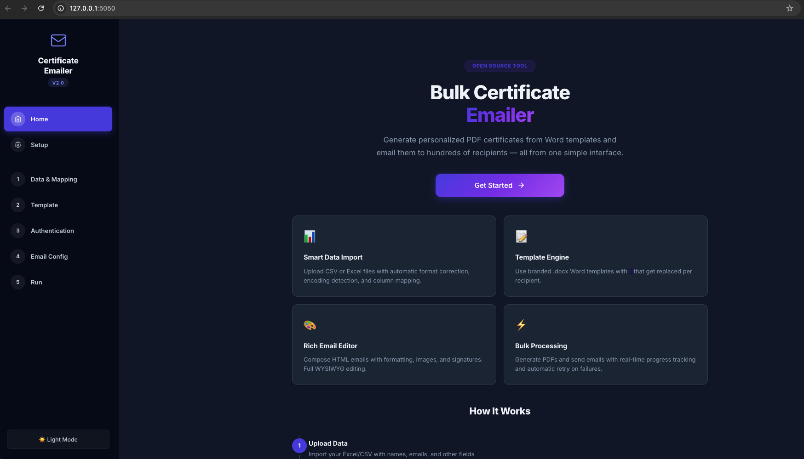
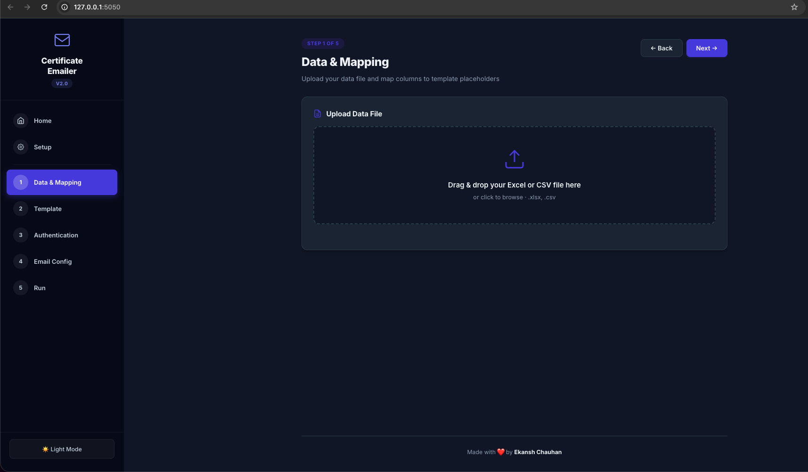
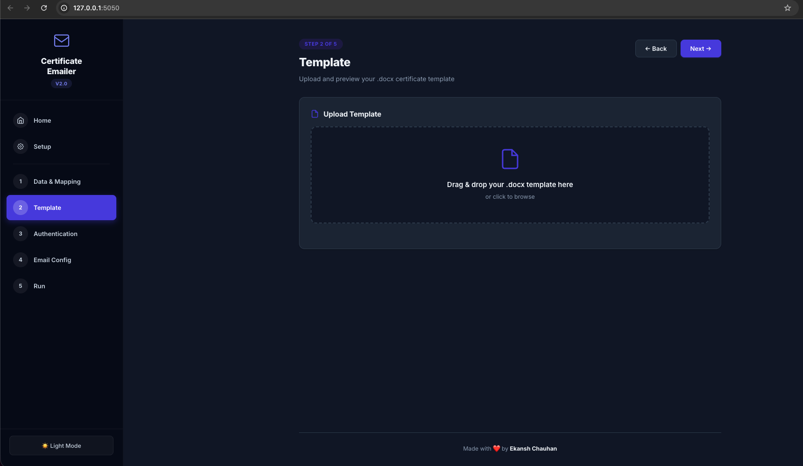
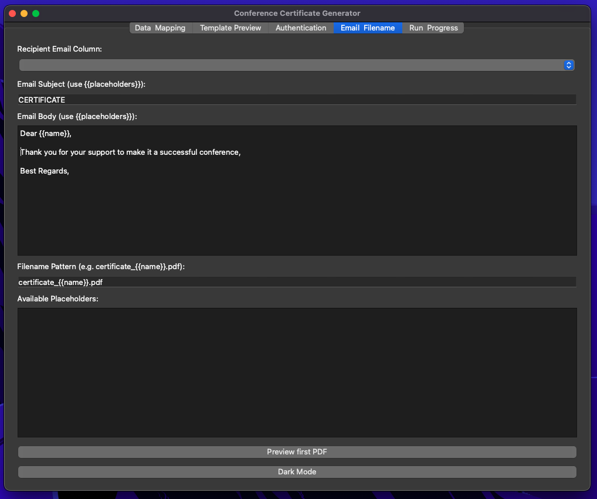
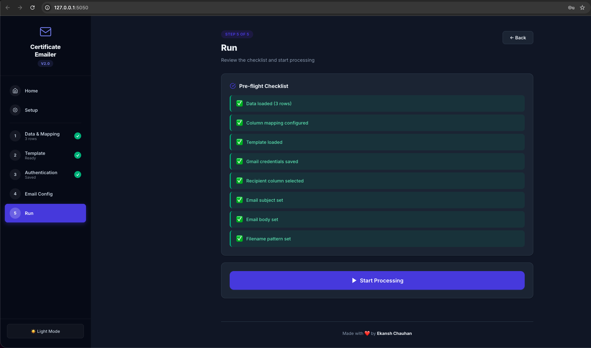

<h1 align="center">📧 Bulk Certificate Emailer</h1>

<p align="center">
  <strong>Send personalized certificates to hundreds of people — in minutes, not hours.</strong><br>
  No coding needed. Just your data, a Word template, and a Gmail account.
</p>

<p align="center">
  
  
</p>

<p align="center">
  <a href="#-see-it-in-action">See It in Action</a> •
  <a href="#-get-started-in-2-minutes">Get Started</a> •
  <a href="#-how-to-use">How to Use</a> •
  <a href="#-need-help">Need Help?</a>
</p>

---

## 💡 What Does It Do?

Imagine you ran a workshop with 200 attendees, and you need to send each one a **personalized PDF certificate** via email. Doing it manually? That's hours of copy-paste nightmare.

With this app, you:
1. Drop in your **Excel/CSV** with names & emails
2. Upload your **Word certificate template**
3. Write one email, hit **Send**
4. ☕ Grab a coffee — it handles the rest

Each person gets their own certificate with their name filled in, converted to PDF, and delivered to their inbox.

---

## ✨ Why You'll Love It

| | |
|---|---|
| 🖱️ **No terminal, no commands** | Just double-click a file to launch |
| 📝 **Use your own Word template** | Design your certificate in Word — the app fills in names automatically |
| 📊 **Works with Excel & CSV** | Drop your spreadsheet in, map the columns, done |
| ✉️ **Beautiful emails** | Rich text editor for your email body — add formatting, images, links |
| 📡 **Live progress** | Watch certificates being generated and emailed in real time |
| 🔄 **Auto-retry** | If an email fails, it tries again automatically |
| 🌙 **Dark & light mode** | Easy on the eyes, whichever you prefer |

---

## 📸 See It in Action

| Home | Upload & Map Your Data |
|:-:|:-:|
|  |  |

| Preview Your Certificate | Compose Your Email |
|:-:|:-:|
|  |  |

| Watch It Send |
|:-:|
|  |

---

## 🚀 Get Started in 2 Minutes

### What You'll Need

Before running the app, make sure you have these two things installed:

1. **Python 3.10 or newer** — [Download here](https://www.python.org/downloads/)
   > ⚠️ **Windows users:** Check **"Add Python to PATH"** during installation — this is important!

2. **LibreOffice** (free) — needed to convert Word files to PDF — [Download here](https://www.libreoffice.org/download/download/)

### Launch the App

| If you're on... | Double-click this file |
|:-:|:-:|
| 🍎 **macOS** | `start.command` |
| 🪟 **Windows** | `start.bat` |

That's it. The app will set itself up automatically and open in your browser.

> First launch takes a minute to install everything. After that, it starts instantly.

---

## 📖 How to Use

### Step 1 — Prepare Your Data

Create an Excel or CSV file with at least these columns:

| Name | Email | Event | Date |
|------|-------|-------|------|
| Alice Johnson | alice@email.com | AI Workshop | Jan 15, 2026 |
| Bob Smith | bob@email.com | AI Workshop | Jan 15, 2026 |

You can have as many columns as you want — you'll map them in the app.

### Step 2 — Create Your Certificate Template

Design your certificate in **Microsoft Word** (`.docx`). Wherever you want personalized data, use `{{column_name}}` placeholders:

> *This certificate is awarded to **{{Name}}** for completing **{{Event}}** on **{{Date}}**.*

The names inside `{{ }}` should match your spreadsheet column headers.

### Step 3 — Set Up Gmail

The app sends emails through your Gmail account. You'll need an **App Password** (not your regular password):

1. Open [Google App Passwords](https://myaccount.google.com/apppasswords)  
   *(you need 2-Step Verification enabled on your Google account)*
2. Create a new app password
3. Copy the 16-character code — you'll paste it in the app

### Step 4 — Send!

In the app:
1. **Upload** your spreadsheet → map columns to placeholders
2. **Upload** your Word certificate template → preview it
3. **Enter** your Gmail + App Password → compose your email
4. **Hit Send** → watch the progress bar as certificates fly out 🚀

Failed emails are retried automatically. You can also download a list of any that didn't go through.

---

## 🛠 Need Help?

<details>
<summary><strong>"LibreOffice not found"</strong></summary>

Download and install LibreOffice from [libreoffice.org](https://www.libreoffice.org/download/download/).

**macOS shortcut** (if you have Homebrew):
```
brew install --cask libreoffice
```
</details>

<details>
<summary><strong>"SMTP Authentication Error" or email won't send</strong></summary>

- Make sure you're using an **App Password**, not your regular Gmail password
- You need **2-Step Verification** turned on in your Google account first
- Try generating a fresh App Password if the old one doesn't work
</details>

<details>
<summary><strong>The app won't start</strong></summary>

- Make sure **Python 3.10+** is installed: open a terminal and type `python --version`
- **Windows:** Did you check "Add Python to PATH" when installing? If not, reinstall Python and check that box
- Try running `python setup.py` in a terminal from the project folder for detailed error messages
</details>

<details>
<summary><strong>Port already in use</strong></summary>

If something else is already using port 5050, you'll see an error. Close the other app or change the port in `app.py` (last line — change `5050` to any free number like `8080`).
</details>

---

## 🤝 Contributing

Contributions are welcome! Fork the repo, create a branch, and open a Pull Request.

---

## 📄 License

Open source under the [MIT License](LICENSE).

---

<p align="center">
  Made with ❤️ by <strong>Ekansh Chauhan</strong>
</p>
