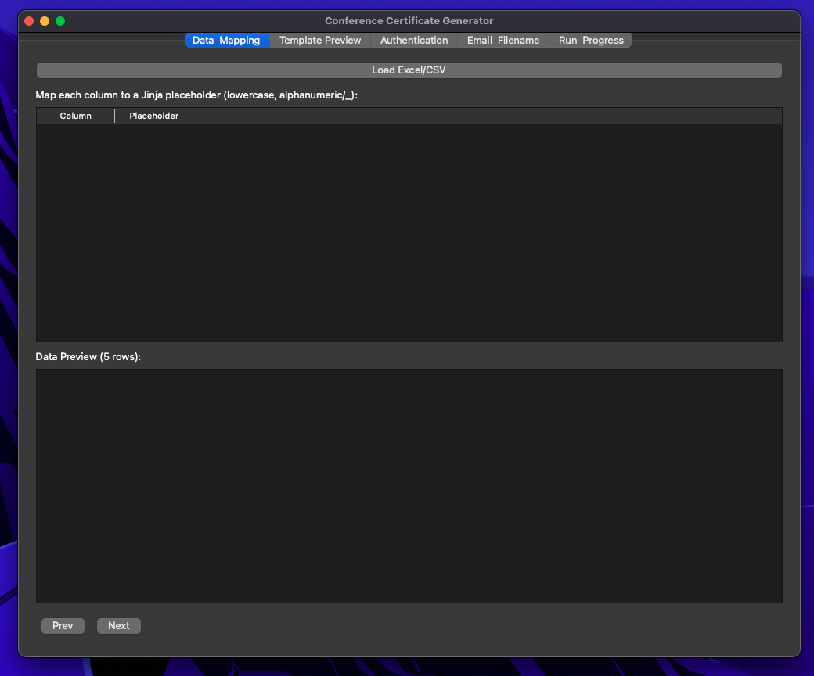
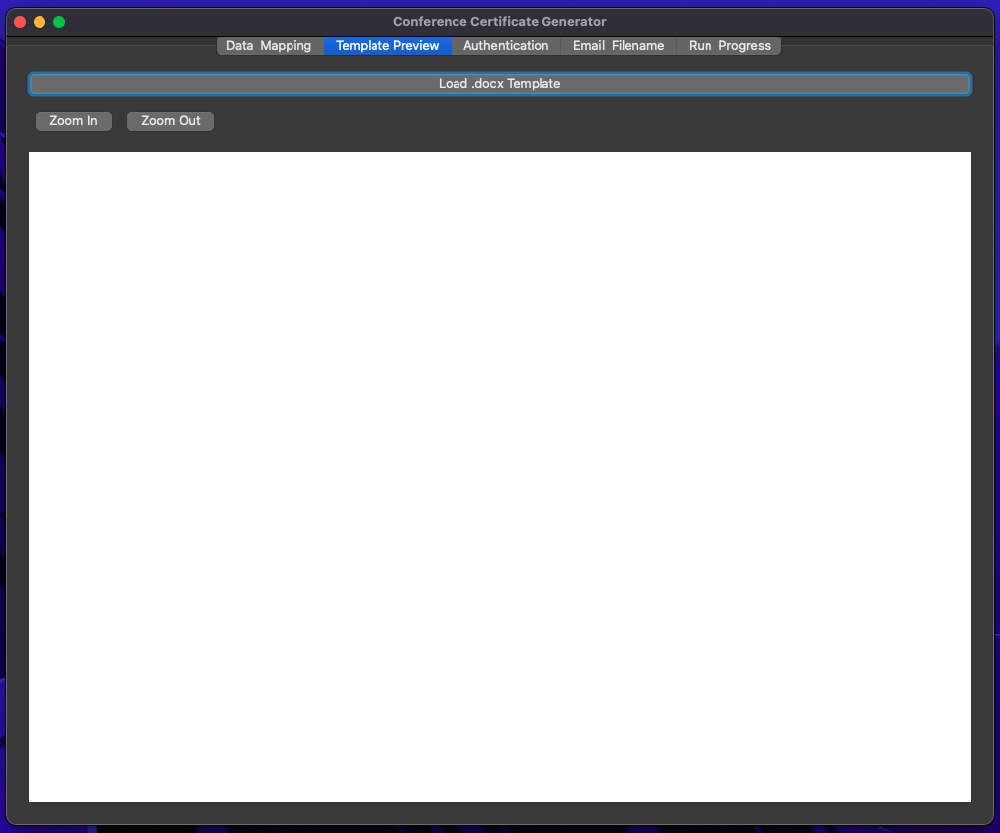
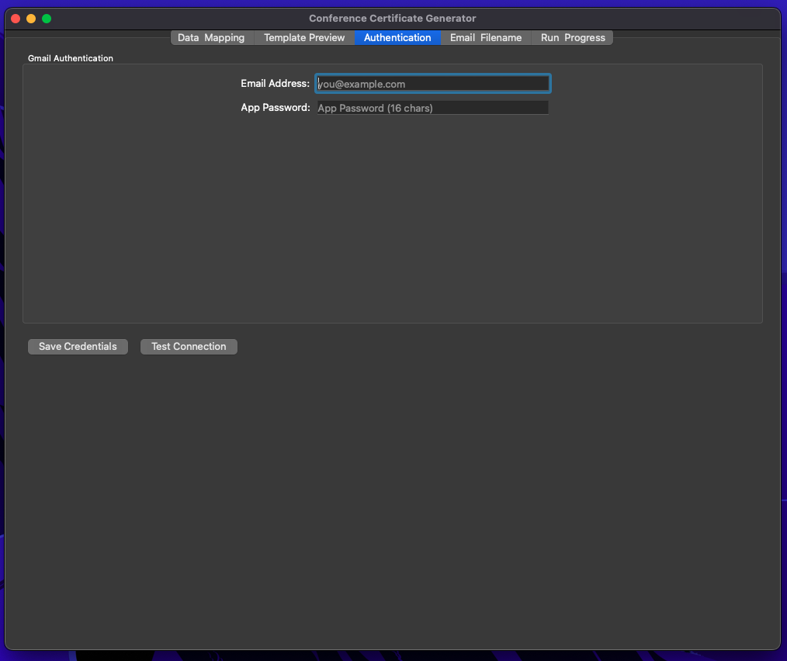
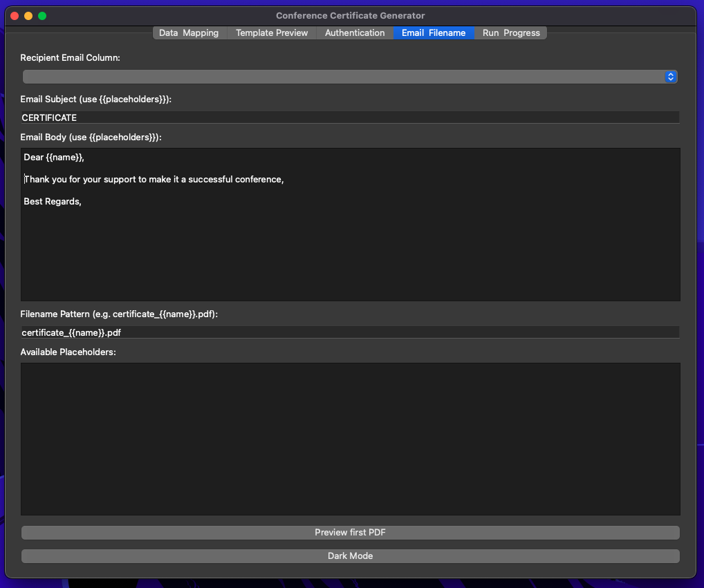
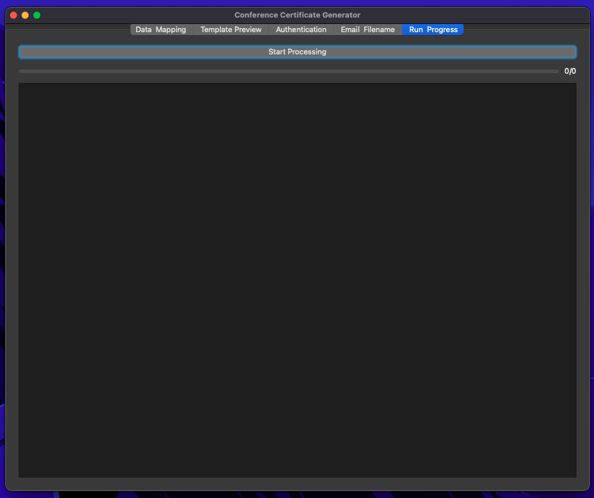

# Conference Certificate Generator & Bulk Emailer

A cross-platform PyQt5 application to generate and send personalized PDF certificates in bulk from a Word template and spreadsheet data via Gmail.

**Author:** Ekansh Chauhan  
**Email:** echauhan09@gmail.com

---

## 📸 Screenshots

Below are screenshots showcasing each main page (tab) and its functionality:

| Data Mapping                    | Template Preview                    | Authentication                    |
| ------------------------------- | ----------------------------------- | --------------------------------- |
|  |  |  |

| Email & Filename                    | Run & Progress                    |
| ----------------------------------- | --------------------------------- |
|  |  |


## 🚀 Features

1. **Data Import & Mapping**

   * Load Excel (`.xlsx`) or CSV (`.csv`) attendee/author lists.
   * Map sheet columns to lowercase Jinja-style placeholders (e.g. `name`, `paper_id`, `email`).
   * Auto-detect the `email` column for bulk emailing recipients.

   


2. **Template Preview**

   * Load a `.docx` template containing `{{placeholders}}`.
   * Live HTML preview with zoom controls before bulk certificate generation.

   

3. **Authentication**

   * Enter Gmail address and App Password in the **Authentication** tab.
   * Securely save credentials in `config.json`.
   * Test SMTP connection to verify bulk emailing capability.

   


4. **Email & Filename Configuration**

   * Specify email subject, body, and filename pattern using any mapped placeholders.
   * Default patterns provided; all fields mandatory for bulk certificate emailing.
   * Real-time list of available placeholders for copy-&-paste.

   

5. **Preview & Confirm**

   * Optionally generate and open the first certificate PDF to verify layout and tags before bulk sending.

6. **Batch Generation & Delivery**

   * Renders each row into a `.docx`, converts to PDF, then sends via Gmail SMTP with retry logic.
   * Progress bar shows percent complete and delivered count (e.g. “23/100”).
   * Detailed log of successes and failures; export `failed_list.csv`.

   

7. **Error Handling**

   * Detects unmapped or improperly cased placeholders in template and email content.
   * Prevents sending until all tags match.
   * Catches network or SMTP errors with automatic retries.

8. **Packaging**

   * Package into a standalone executable via PyInstaller for easy distribution.

---

## 🛠️ Installation

1. **Clone the repository**

   ```bash
   git clone https://github.com/ekansh09/Bulk-Certificate-Emailing.git
   cd Bulk-Certificate-Emailing
   ```

2. **Create a virtual environment & install dependencies**

   ```bash
   python3 -m venv venv
   venv\Scripts\activate    # MacOS: source venv/bin/activate
   pip install -r requirements.txt
   ```

3. **Run the app**

   ```bash
   python app.py
   ```


4. **(Optional) Package the app**

   ```bash
   pip install pyinstaller
   pyinstaller --noconsole --onefile app.py

   ```
   ```bash
   pyinstaller --noconsole --onefile --collect-all numpy --collect-all pandas app.py
   ```

---

## ⚙️ Configuration

1. **Gmail App Password**

   * Generate a 16-character App Password via your Google Account settings.
   * Enter it on the **Authentication** tab with your Gmail address, then click **Test Connection** and **Save Credentials**.

2. **Spreadsheet**

   * Ensure your sheet has an `email` column plus other columns to merge.
   * Example: `paper_id, name, title, email` or `s_no, name, post, email`.

3. **Word Template**

   * Use lowercase Jinja-style tags matching your placeholders, e.g.:

     ```text
     Certificate of Participation
     This certifies that {{name}} contributed as {{post}}.
     ```

---

## 🚀 Usage

1. **Load Data & Map Columns**

   * In **Data & Mapping** tab: click **Load Excel/CSV**, map columns to placeholders.

2. **Load Template & Preview**

   * Switch to **Template Preview**, click **Load .docx Template**, zoom/scroll to inspect.

3. **Authenticate**

   * Go to **Authentication** tab, enter Gmail & App Password, click **Test Connection**, then **Save Credentials**.

4. **Configure Email & Filename**

   * In **Email & Filename** tab: select `email` column, edit subject/body, set filename pattern (e.g. `Certificate_{{name}}.pdf`).

5. **Preview First PDF** (optional)

   * Check **Preview first PDF** to generate/open the first certificate before bulk sending.

6. **Start Bulk Generation & Email**

   * Go to **Run & Progress**, click **Start Processing**.
   * Monitor the progress bar and counter (e.g. “12/100”).
   * Review live log; export `failed_list.csv` if any deliveries failed.

---

## 💡 Troubleshooting

* **Tag Errors**: Alerts for undefined or uppercase placeholders.
* **Slow Performance**: Disable preview or reduce batch size.
* **Packaging Issues**: See [PyInstaller docs](https://pyinstaller.org).

---

## 📄 License

This project is licensed under the MIT License.
© Ekansh Chauhan